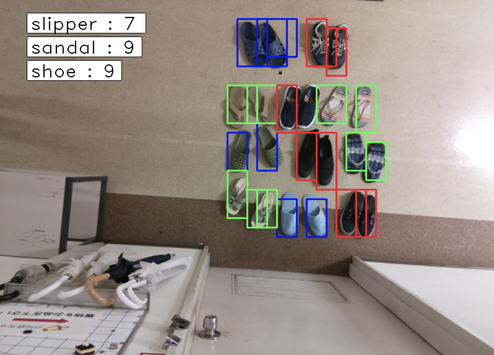

# Shoes Detection using Faster R-CNN

We developed an application which detects different kinds of shoewear such as a slipper, sandal and shoe.

## Execution Procedure

1. Take a picture of shoes and send it to the GPU machine every few seconds
2. Count the number of each types of shoes in the picture and create a result image
3. Display the result on PC

## Experimental Results

<table>
    <tr>
      <td rowspan="2"></td>
      <td colspan=4 align="center">Classified As</td>
    </tr>
    <tr>
      <th>Shoe</th>
      <th>Sandal</th>
      <th>Slipper</th>
      <th>BG</th>
    </tr>
    <tr>
      <th>Shoe</th>
      <td align="right">9</td>
      <td align="right">3</td>
      <td align="right">0</td>
      <td align="right">12</td>
    </tr>
    <tr>
      <th>Sandal</th>
      <td align="right">0</td>
      <td align="right">10</td>
      <td align="right">0</td>
      <td align="right">3</td>
    </tr>
    <tr>
      <th>Slipper</th>
      <td align="right">0</td>
      <td align="right">0</td>
      <td align="right">17</td>
      <td align="right">4</td>
    </tr>
    <tr>
      <th>BG</th>
      <td align="right">1</td>    
      <td align="right">3</td>
      <td align="right">4</td>
      <td align="center">-</td>
    </tr>
</table>

When BG (BackGround) is recognized as a shoe, it means that the program detected a shoe by mistake.

When a shoe is recognized as BG, it means that the program missed the shoe.

The result shows that our shoe detection model can detect shoes and classify them, yet it is not perfect.
It seems that the program often fails to localize objects when multiple shoes are put close together or they are slanted.

## How to Use

We used raspi-3 as a shoes capturing camera. And jupyter notebook *shoes_detector.ipynb* as a shoe detector, result presenter. On raspi, we used *raspi_client.py* to take shoe picture for every second and send it to GPU-machine by TCP. On GPU-machine, we activate *shoes_detector.ipynb*'s recieve & detect script.

## Folders
We saved training, test images and annotations in *data/*.

## Training and test
We used *PhaseGenerator.py* to controls the slave script *train_frcnn.py* and *with_output_dir_test_frcnn.py*. As a result we can train multiple training and test phase in one run.

## Result
PhaseGenerator.py's result for detecting test pictures are saved in *result_imgs/*. Also training log, best score weight are saved in *logs/* and *weights/*. Saving name *model_frcnn_X* have an index *X* which is the identity for log, weight, pickle file.

Example in file naming:

weight: model_frcnn_5.hdf5  

log: model_frcnn_5.txt

result image directory: model_frcnn_5/
